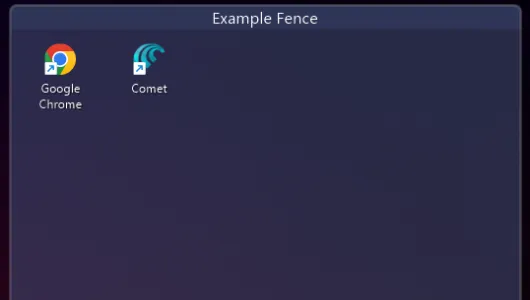

# Fenceless

Fenceless is a Windows desktop organization tool for grouping files, folders, and live widgets into movable transparent containers called fences.

It is an improved fork of [NoFences](https://github.com/Twometer/NoFences), renamed and expanded with a modern Settings window, widget fence types, global hotkeys, logging, backup support, and safer persistence.



## Features

- Create movable desktop fences for files and folders
- Drag and drop items into organized groups
- Live Folder fences that mirror a real folder
- Running Tasks fences for active windows
- Clipboard History fences with optional image capture
- Transparency, auto-hide, shadow, border, color, icon size, and spacing controls
- Global keyboard shortcuts for common actions
- Search, sorting, context menus, and desktop-aware positioning
- Tray menu for adding fences, opening Settings, viewing logs, startup control, and exit
- Automatic saves, startup recovery backups, and JSON import/export
- In-app log viewer for debugging

## What's New In v1.1.0.0

- Safer fence metadata saves with atomic writes and backup recovery
- Typed import validation and fence setting normalization
- Improved Settings window with a dense Fluent-style layout, Backup page, inline validation, and typed fence creation
- Hotkey conflict reporting for shortcuts already registered by Windows or another app
- Autosave now avoids overlapping saves and applies interval changes without restart
- Update checking now selects the highest parsed release version instead of trusting API ordering
- Expanded regression tests for parsing, layout, widget snapshots, import validation, and settings normalization

## Requirements

- Windows 10 or Windows 11
- .NET 8 Desktop Runtime for portable builds

Download the runtime from Microsoft:
[.NET 8 Desktop Runtime](https://dotnet.microsoft.com/en-us/download/dotnet/8.0)

## Installation

1. Download the latest portable release from [Codeberg Releases](https://codeberg.org/Wavestorm/Fenceless/releases).
2. Extract the archive to a folder you control, such as `C:\Apps\Fenceless`.
3. Run `Fenceless.exe`.
4. Use the tray icon to add fences, open Settings, view logs, or exit.

Fenceless stores user data under:

```text
%LOCALAPPDATA%\Fenceless
```

## Basic Usage

- Right-click the tray icon and choose `Add Fence` to create a new fence.
- Drag files or folders into a standard fence.
- Right-click a fence for fence-specific options.
- Open `Settings` from the tray icon to edit defaults, hotkeys, appearance, active fences, and backups.
- Use `View Logs` from the tray icon when diagnosing behavior.

## Fence Types

`Standard Fence`
: A manually managed group of files and folders.

`Live Folder`
: Shows files and folders from a configured watch path. Supports recursion, filtering, and max item limits.

`Running Tasks`
: Shows currently running windows/tasks with optional filtering and update interval controls.

`Clipboard History`
: Shows recent clipboard entries and can capture images when enabled.

## Default Hotkeys

| Action | Shortcut |
| --- | --- |
| Toggle transparency | `Ctrl+Alt+T` |
| Toggle auto-hide | `Ctrl+Alt+H` |
| Show all fences | `Ctrl+Alt+S` |
| Create new fence | `Ctrl+Alt+N` |
| Open Settings | `Ctrl+Alt+O` |
| Toggle lock | `Ctrl+Alt+L` |
| Minimize all fences | `Ctrl+Alt+M` |
| Refresh fences | `F5` |

Hotkeys can be changed or cleared in Settings. If Windows reports that a shortcut is already registered, Fenceless will keep running and show the conflict in Settings/logs.

## Backups And Import/Export

Fenceless saves configuration in `%LOCALAPPDATA%\Fenceless`.

- App settings are saved to `settings.json`.
- Each fence has metadata under its own folder.
- Fence metadata writes are atomic and keep a recovery backup.
- On shutdown, Fenceless writes timestamped JSON backups under:

```text
%LOCALAPPDATA%\Fenceless\backups
```

Use the Settings `Backup` page to export or import a portable JSON configuration.

## Building From Source

Prerequisites:

- .NET 8 SDK
- Windows with Windows Forms support

Build:

```powershell
dotnet build Fenceless.sln
```

Run tests:

```powershell
dotnet run --project Fenceless.Tests\Fenceless.Tests.csproj
```

Release builds are self-contained according to the project configuration:

```powershell
dotnet publish Fenceless\Fenceless.csproj -c Release
```

If Fenceless is already running from the debug output folder, close it before building in place. Windows will lock `Fenceless.exe` and `Fenceless.dll` while the app is running.

## Troubleshooting

`Hotkey already in use`
: Another app or Windows has registered the same shortcut. Change or clear the shortcut in Settings.

`Build cannot copy Fenceless.exe or Fenceless.dll`
: Close the running Fenceless process, then build again.

`Live Folder shows no items`
: Check that the watch path exists and that the file filter is not excluding everything.

`Settings or fences do not persist`
: Open `View Logs` from the tray menu and check for file access errors under `%LOCALAPPDATA%\Fenceless`.

## Project Structure

```text
Fenceless/          Main WinForms application
Fenceless/Model/    Settings, fence models, providers, import/export
Fenceless/UI/       Settings window, themed controls, dialogs, widgets
Fenceless/Util/     Logging, autosave, hotkeys, startup, parsing, caching
Fenceless/Win32/    Windows integration helpers
Fenceless.Tests/    Lightweight console regression tests
```

## Credits

- Original [NoFences](https://github.com/Twometer/NoFences) by Twometer
- Fenceless improvements by [Damianttje](https://codeberg.org/damianttje) / [Wavestorm](https://codeberg.org/Wavestorm)

## License

See [LICENSE](LICENSE).
